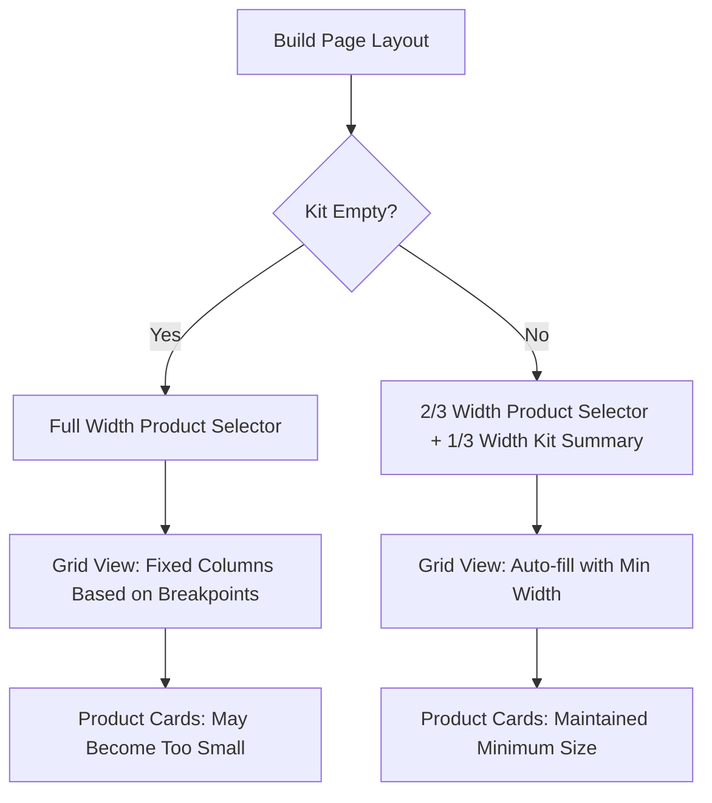

# Fix for Grid View Product Listings Becoming Small When Kit Summary Opens

## Overview

This document addresses an issue in the AT-Supply-Finder application where product listings in grid view become very small when the add button is clicked and the kit summary section opens up on the product build page. The problem affects the user experience by making products difficult to view and interact with.

## Problem Analysis

### Root Cause

The issue occurs in the `Build.tsx` page component where the layout changes when items are added to the kit. Specifically:

1. When the kit is empty, the product selector takes the full width of the container (full 3-column span)
2. When items are added to the kit, the layout changes to a grid with the kit summary taking 1/3 of the width and the product selector taking 2/3 (2-column span)
3. The grid view in `CategoryProductSelector.tsx` uses fixed responsive column counts (1 column on small screens, 2 on medium, 3 on large, and 4 on extra-large)
4. When the container becomes narrower due to the kit summary appearing, the grid items become compressed because the minimum width for grid items isn't maintained

### Key Components Involved

1. `src/pages/Build.tsx` - Main build page that changes layout when kit has items
2. `src/components/kit/CategoryProductSelector.tsx` - Component that displays products in grid or table view
3. `src/components/kit/KitSummary.tsx` - Component that appears when items are added to the kit

## Solution Design

### Current Implementation Issues

In `CategoryProductSelector.tsx`, the grid view is implemented with fixed breakpoints:
```tsx
<div className="grid gap-6 grid-cols-1 sm:grid-cols-2 lg:grid-cols-3 xl:grid-cols-4">
```

This approach doesn't account for the fact that when the kit summary is visible, the container width is reduced to 2/3 of the full width, causing the grid items to become very small.

### Recommended Solution

Implement a dynamic grid system that adapts to the container width by:

1. Using CSS Grid with `auto-fill` and `minmax()` functions
2. Adjusting minimum item widths based on whether the kit summary is visible
3. Maintaining consistent spacing and aspect ratios

### Detailed Implementation

#### 1. Update Grid Container in CategoryProductSelector.tsx

Replace the current grid div with a more responsive implementation:

```tsx
// Current implementation (line ~605)
<div className="grid gap-6 grid-cols-1 sm:grid-cols-2 lg:grid-cols-3 xl:grid-cols-4">

// New implementation
<div 
  className="grid gap-6"
  style={{ 
    gridTemplateColumns: kit.length > 0 
      ? 'repeat(auto-fill, minmax(200px, 1fr))' 
      : 'repeat(auto-fill, minmax(240px, 1fr))'
  }}
>
```

This change ensures that:
- When the kit is empty (full width container), items have a minimum width of 240px
- When the kit has items (narrower container), items have a minimum width of 200px
- The grid automatically adjusts the number of columns based on available space
- Items never become smaller than the specified minimum width

#### 2. Improve Card Sizing Consistency

Update the Card component to ensure consistent sizing:

```tsx
// Current implementation (line ~608)
<Card key={product.id} className={`transition-all hover:shadow-lg ${isInKit ? 'ring-2 ring-primary' : ''}`}>

// New implementation
<Card 
  key={product.id} 
  className={`transition-all hover:shadow-lg h-full flex flex-col ${isInKit ? 'ring-2 ring-primary' : ''}`}
>
```

#### 3. Enhance Image Container for Better Aspect Ratio

Improve the image container to maintain consistent proportions:

```tsx
// Current implementation (line ~612)
<div className="bg-secondary/70 rounded-xl p-3 flex items-center justify-center aspect-square relative overflow-hidden">

// New implementation
<div className="bg-secondary/70 rounded-xl p-3 flex items-center justify-center aspect-square relative overflow-hidden flex-grow">
```

## Visual Representation



## Implementation Steps

1. **Modify the grid container in `CategoryProductSelector.tsx`**:
   - Replace the fixed grid classes with dynamic CSS Grid properties
   - Use `minmax()` function to ensure minimum card width
   - Adjust minimum width based on kit visibility

2. **Update the Card component**:
   - Add `h-full flex flex-col` classes for consistent height
   - Ensure proper flex behavior for content distribution

3. **Improve the image container**:
   - Maintain `aspect-square` for consistent product image display
   - Add `flex-grow` to allow proper expansion

4. **Test the implementation**:
   - Verify grid layout when kit is empty
   - Verify grid layout when kit has items (kit summary visible)
   - Test responsive behavior on different screen sizes

## Before and After Comparison

### Before (Problematic Behavior)
```
Full Width Container (Kit Empty):
[ CARD ][ CARD ][ CARD ][ CARD ]  <- 4 columns on large screens

Reduced Width Container (Kit Has Items):
[ C ][ C ][ C ][ C ]  <- Cards become too small and compressed
```

### After (Fixed Behavior)
```
Full Width Container (Kit Empty):
[ CARD ][ CARD ][ CARD ][ CARD ]  <- 4 columns on large screens

Reduced Width Container (Kit Has Items):
[  CARD  ][  CARD  ]  <- Automatically reduced to 2 columns with proper sizing
```

## Testing Plan

1. **Layout Verification**
   - Confirm grid layout when kit is empty (full width)
   - Confirm grid layout when kit has items (reduced width)
   - Verify consistent spacing between grid items

2. **Responsive Testing**
   - Test on mobile devices (320px width)
   - Test on tablet devices (768px width)
   - Test on desktop devices (1024px+ width)

3. **Visual Consistency**
   - Ensure product cards maintain minimum readable size
   - Confirm images maintain proper aspect ratio
   - Verify text remains legible at all screen sizes

4. **Interaction Testing**
   - Test add/remove functionality
   - Verify hover states work correctly
   - Confirm all interactive elements are accessible

## Performance Considerations

1. The solution uses CSS Grid with `minmax()` which is highly performant
2. No additional JavaScript calculations needed for layout
3. Minimal reflows due to CSS-based solution
4. Efficient rendering with React's virtual DOM

## Accessibility Considerations

1. Maintain proper contrast ratios for text and interactive elements
2. Ensure keyboard navigation works properly in grid view
3. Preserve screen reader accessibility for product information
4. Keep focus indicators visible for interactive elements