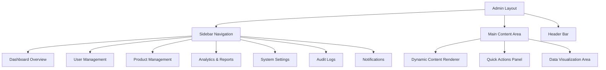
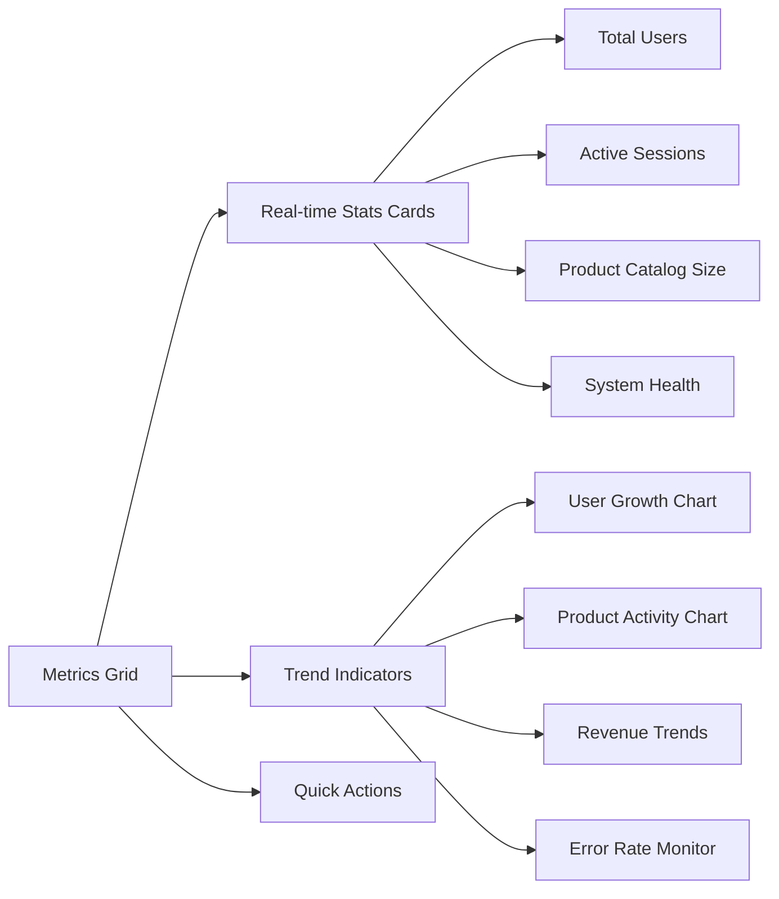
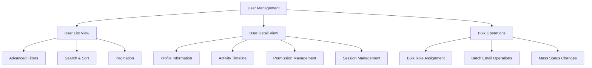
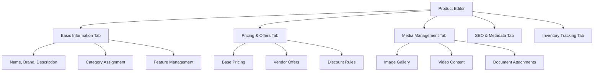
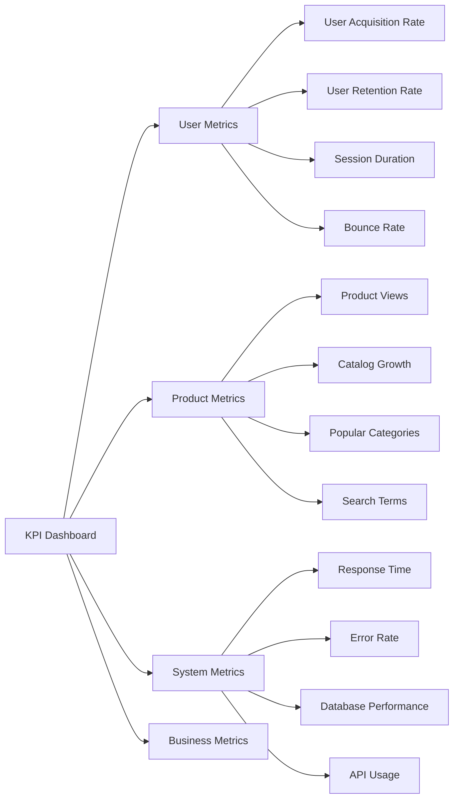
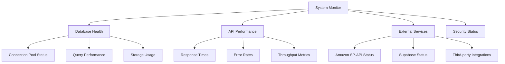
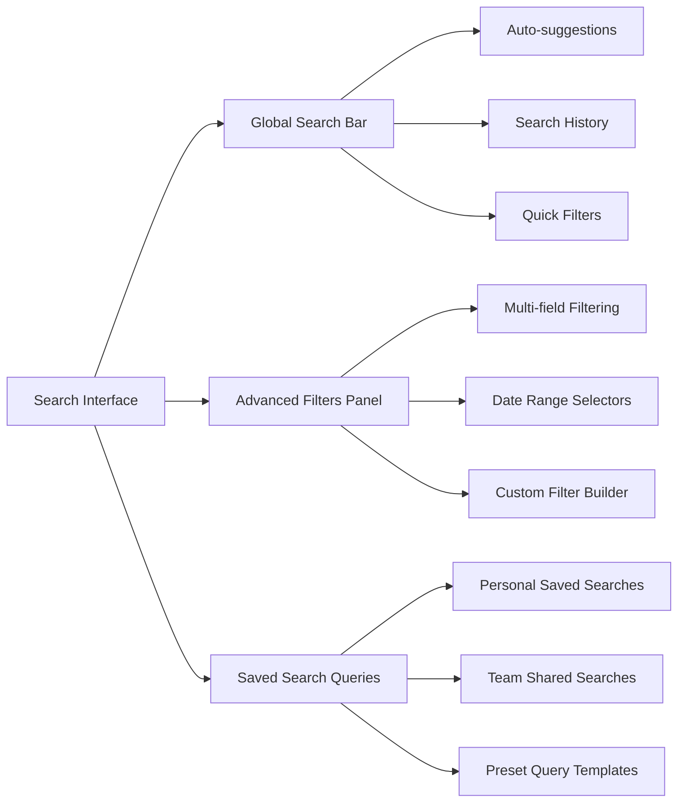
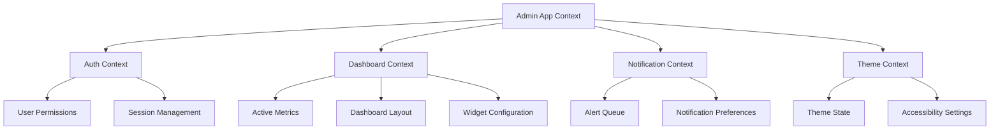
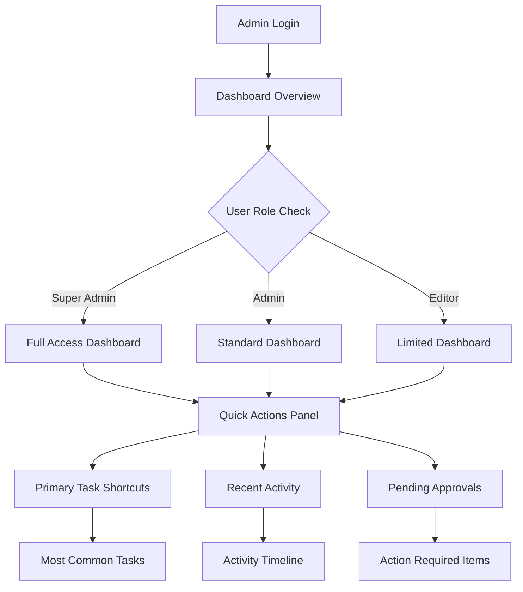

# Admin Dashboard Improvements

## Overview

This design document outlines comprehensive improvements to the wrap-wizard-finder admin dashboard, focusing on enhanced functionality, modern UI/UX patterns, and improved user experience. The current admin dashboard provides basic functionality for user management, product management, starter kit building, and analytics. This improvement initiative aims to transform it into a modern, efficient, and intuitive administrative interface following current design trends and best practices.

## Technology Stack & Dependencies

### Current Technology Foundation
- **Frontend Framework**: React 18 with TypeScript
- **UI Components**: shadcn-ui with Tailwind CSS
- **State Management**: React Context API, React Query
- **Database & Auth**: Supabase (PostgreSQL)
- **Charts & Visualization**: Recharts (planned addition)
- **Form Handling**: React Hook Form with Zod validation

### New Dependencies Required
```json
{
  "recharts": "^2.8.0",
  "react-beautiful-dnd": "^13.1.1",
  "framer-motion": "^10.16.4",
  "date-fns": "^2.30.0",
  "react-virtualized": "^9.22.5"
}
```

## Enhanced Component Architecture

### 1. Dashboard Layout System

#### Enhanced Navigation Structure


#### Responsive Sidebar Component
- **Collapsible sidebar** with persistent state
- **Icon-only mode** for mobile/tablet devices
- **Breadcrumb navigation** for better wayfinding
- **Quick search** functionality across all admin sections

### 2. Enhanced Dashboard Overview

#### Key Metrics Dashboard


#### Interactive Statistics Cards
- **Real-time data updates** with WebSocket integration
- **Trend arrows and percentage changes** with color coding
- **Drill-down capabilities** to detailed views
- **Responsive grid layout** with priority-based reordering

### 3. Advanced User Management Interface

#### Enhanced User Table Features
- **Advanced filtering system** (role, status, registration date, activity)
- **Bulk operations panel** (role assignment, activation/deactivation, deletion)
- **User activity timeline** with audit trail
- **Export functionality** (CSV, PDF reports)

#### User Profile Management


#### Role-Based Access Control (RBAC) Enhancement
- **Granular permission system** with feature-level controls
- **Custom role creation** with permission templates
- **Permission inheritance** and role hierarchy
- **Visual permission matrix** for easy management

### 4. Product Management Enhancements

#### Advanced Product Catalog Interface
- **Category-based organization** with nested structures
- **Bulk product import/export** functionality
- **Image management system** with upload and optimization
- **Product variant management** for different configurations

#### Enhanced Product Editor


### 5. Analytics & Reporting Dashboard

#### Comprehensive Analytics Suite
- **Real-time dashboard widgets** with customizable layouts
- **Advanced chart types** (line, bar, pie, heat maps, funnel charts)
- **Custom date range selectors** with preset options
- **Comparative analysis tools** (period-over-period, cohort analysis)

#### Key Performance Indicators (KPIs)


#### Report Generation System
- **Automated report scheduling** with email delivery
- **Custom report builder** with drag-and-drop interface
- **Data visualization templates** for common report types
- **Export capabilities** (PDF, Excel, CSV, JSON)

### 6. System Settings & Configuration

#### Modular Settings Interface
- **Categorized settings panels** with search functionality
- **Environment-specific configurations** (dev, staging, production)
- **Feature flag management** for A/B testing
- **API key and integration management**

#### System Health Monitoring


## Enhanced UI/UX Design Patterns

### 1. Modern Dark Mode Implementation
- **Automatic theme detection** based on system preferences
- **High contrast mode** for accessibility compliance
- **Smooth theme transitions** with CSS animations
- **Theme-aware data visualizations** with appropriate color schemes

### 2. Progressive Loading & Performance
- **Skeleton loading screens** for better perceived performance
- **Virtual scrolling** for large data sets
- **Lazy loading** for images and non-critical components
- **Optimistic updates** for better user feedback

### 3. Interactive Data Visualization
- **Hover tooltips** with detailed information
- **Click-through drill-downs** to detailed views
- **Zoom and pan capabilities** for charts
- **Data export options** directly from visualizations

### 4. Advanced Search & Filtering


### 5. Notification & Alert System
- **Real-time notifications** for system events
- **Customizable alert thresholds** for metrics
- **Notification center** with categorization and filtering
- **Email digest options** for important updates

## State Management & Data Flow

### Enhanced Context Architecture


### Data Fetching Strategy
- **React Query implementation** for server state management
- **Optimistic updates** for better user experience
- **Background data refresh** with stale-while-revalidate pattern
- **Error boundary handling** with user-friendly error messages

## Accessibility & User Experience

### WCAG 2.1 Compliance
- **Keyboard navigation support** for all interactive elements
- **Screen reader compatibility** with proper ARIA labels
- **High contrast color schemes** for visual impairments
- **Focus management** and logical tab order

### Responsive Design Patterns
- **Mobile-first design approach** with progressive enhancement
- **Touch-friendly interface elements** for tablet/mobile use
- **Adaptive layouts** that prioritize content based on screen size
- **Consistent interaction patterns** across all device types

### User Workflow Optimization


## Security & Performance Considerations

### Enhanced Security Measures
- **Activity logging** for all admin actions
- **Session timeout management** with auto-save functionality
- **IP restriction capabilities** for admin access
- **Two-factor authentication** support for admin users

### Performance Optimization
- **Code splitting** by feature modules
- **Bundle size optimization** with tree shaking
- **Image optimization** with WebP format support
- **CDN integration** for static assets

### Error Handling & Monitoring
- **Comprehensive error boundaries** with fallback UI
- **Client-side error tracking** with detailed context
- **Performance monitoring** with core web vitals
- **User feedback collection** for UX improvements

## Testing Strategy

### Component Testing
- **Unit tests** for all custom hooks and utilities
- **Component integration tests** for complex interactions
- **Visual regression testing** for UI consistency
- **Accessibility testing** with automated tools

### User Experience Testing
- **Usability testing sessions** with admin users
- **A/B testing framework** for UI improvements
- **Performance benchmarking** against current implementation
- **Cross-browser compatibility testing**