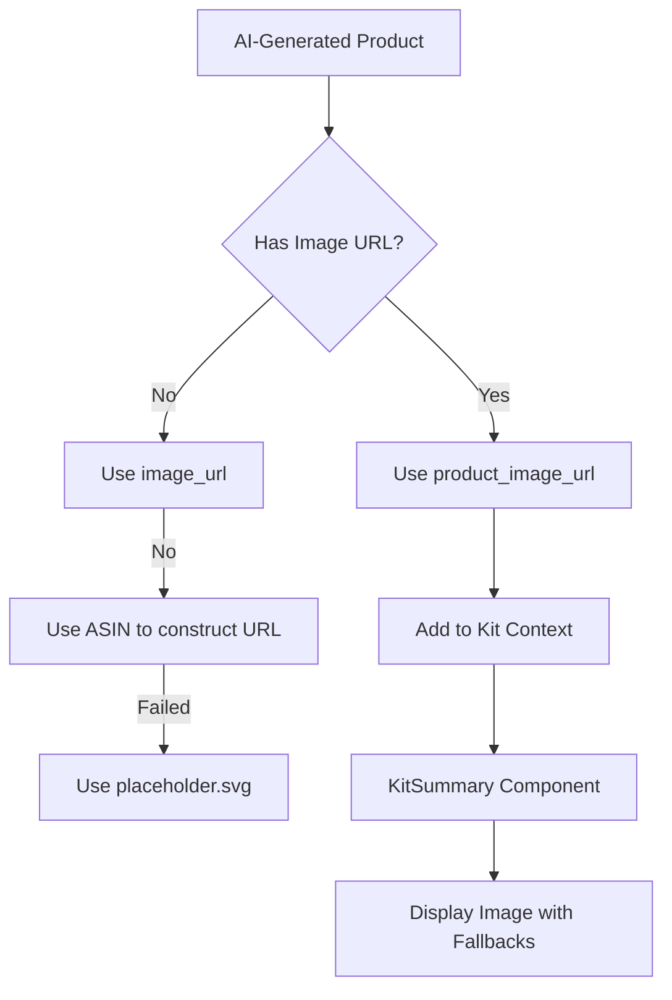

# Product Image Display Fix for AI-Generated Kits

## Overview

This document outlines the design for fixing the issue where product images are not displaying correctly in the kit summary for AI-generated kits. The problem occurs because AI-generated products use different property names for images than standard products, and the KitSummary component doesn't handle these variations properly.

## Problem Analysis

### Current State
1. AI-generated products store image URLs in a property called `product_image_url`
2. Standard scraped products store image URLs in a property called `image_url`
3. The KitSummary component only looks for `imageUrl` property
4. When AI-generated products are added to the kit, their image URLs are not properly mapped to the expected property

### Root Cause
In the `kit-context.tsx` file, when products are added to the kit, there's logic to handle `imageUrl` but it doesn't account for `product_image_url` from AI-generated products:

```typescript
imageUrl: product.imageUrl || (product as any).product_image_url || product.image_url || '',
```

However, this mapping might not be working correctly for all cases, and the KitSummary component doesn't have proper fallback handling.

## Solution Design

### 1. Enhanced Image Property Mapping
Update the `addToKit` function in `kit-context.tsx` to properly handle all possible image property names:

```typescript
imageUrl: product.imageUrl || 
          (product as any).product_image_url || 
          product.image_url || 
          (product as any).imageURL || 
          (product as any).productImageURL ||
          '',
```

### 2. Improved Fallback Handling in KitSummary
Enhance the image loading in `KitSummary.tsx` with better error handling and more robust fallbacks:

```typescript
onError={(e) => {
  const target = e.target as HTMLImageElement;
  console.log('Image failed to load for item:', item.name, 'URL:', item.imageUrl);
  // Try multiple fallback approaches
  if (target.src.includes('amazon.com') && item.asin) {
    // Try to construct image URL from ASIN
    target.src = `https://m.media-amazon.com/images/I/${item.asin}._SL1500_.jpg`;
  } else if (target.src !== window.location.origin + "/placeholder.svg") {
    target.src = "/placeholder.svg";
  }
}}
```

### 3. Standardize Image Property Names
Create a utility function to normalize image properties when products are added to the kit:

```typescript
const normalizeProductImage = (product: Product): string => {
  return product.imageUrl || 
         (product as any).product_image_url || 
         product.image_url || 
         (product as any).imageURL || 
         (product as any).productImageURL ||
         '';
};
```

## Implementation Plan

### Phase 1: Update Kit Context
1. Modify the `addToKit` function in `src/context/kit-context.tsx`
2. Add proper image URL normalization logic
3. Ensure all product sources are handled (scraped, AI-generated, manually added)

### Phase 2: Enhance UI Components
1. Update `KitSummary.tsx` with improved image loading and error handling
2. Update `KitItem.tsx` with the same improvements
3. Add better logging for debugging image loading issues

### Phase 3: Add Fallback Mechanisms
1. Implement ASIN-based image URL construction as a fallback
2. Add better placeholder handling
3. Add error boundaries for image loading failures

## Data Flow Architecture



## Error Handling Strategy

1. **Image Load Failure**: Implement multiple fallback strategies:
   - Original image URL from product data
   - Constructed URL from ASIN
   - Placeholder image

2. **Logging**: Add detailed console logging for debugging:
   - Which image URL was attempted
   - Why it failed
   - Which fallback was used

3. **User Experience**: Ensure graceful degradation:
   - Always show a placeholder if real image fails
   - Maintain layout consistency

## Testing Plan

### Unit Tests
1. Test image URL normalization function with various input formats
2. Test KitContext addToKit function with different product types
3. Test image loading error handling

### Integration Tests
1. Test complete flow from AI product generation to kit display
2. Test image loading with various failure scenarios
3. Test fallback mechanisms

### Manual Testing
1. Verify AI-generated kit products display images correctly
2. Verify standard scraped products still work
3. Test with products that have no image data

## Security Considerations

1. Ensure all image URLs are properly sanitized before rendering
2. Validate image sources to prevent XSS vulnerabilities
3. Use proper Content Security Policy headers

## Performance Considerations

1. Implement lazy loading for kit images
2. Use appropriate image dimensions to reduce bandwidth
3. Cache image URLs to prevent repeated failures