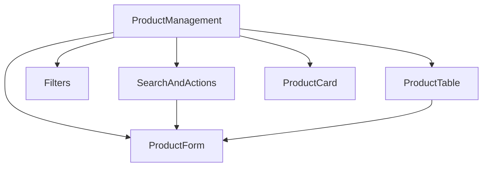
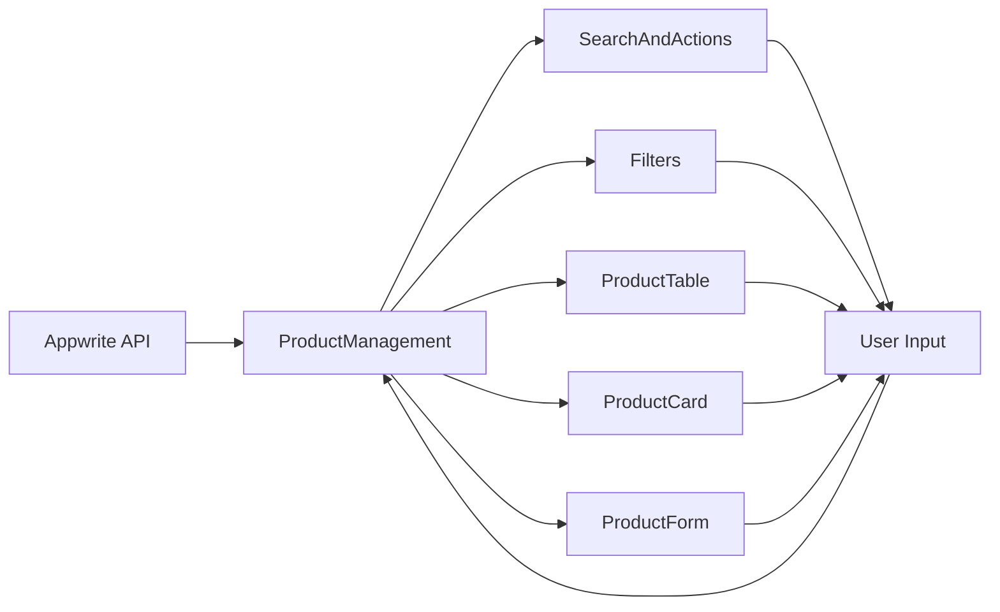

# Product Management Refactor Design Document

## 1. Overview

This document outlines the refactoring of the product management system in the AT-Supply-Finder application. The current implementation has two similar files with significant code duplication. The goal is to create a clean, modular architecture by removing the redundant file and keeping the properly refactored version.

## 2. Current State Analysis

### 2.1 Problem Identification

The current implementation has the following issues:
- **Code Duplication**: Two nearly identical files (`ProductManagement.tsx` and `ProductManagementRefactored.tsx`)
- **Large File Size**: Original file is 75.1KB with 1925 lines of code
- **Poor Maintainability**: All logic is in one component, making it hard to modify
- **Confusion**: Having two similar files causes confusion about which one is the correct implementation

### 2.2 File Sizes
- `ProductManagement.tsx`: 75.1KB (1925 lines)
- `ProductManagementRefactored.tsx`: 47.5KB (1342 lines)
- Component files: 1.3KB-38.3KB each

### 2.3 Component Analysis

The refactored version properly splits functionality into:
- `ProductTable.tsx`: Handles tabular product display
- `ProductCard.tsx`: Handles card-based product display
- `ProductForm.tsx`: Handles product creation/editing forms
- `Filters.tsx`: Handles advanced filtering UI
- `SearchAndActions.tsx`: Handles search functionality and action buttons

## 3. Proposed Architecture

### 3.1 Component Structure



### 3.2 Component Responsibilities

| Component | Responsibility |
|-----------|----------------|
| `ProductManagement` | Main container managing state and data fetching |
| `SearchAndActions` | Search input, filters toggle, and action buttons |
| `Filters` | Advanced filtering options UI |
| `ProductTable` | Tabular display of products with actions |
| `ProductCard` | Card-based display of products for mobile/responsive views |
| `ProductForm` | Form for creating/editing products |

### 3.3 Data Flow

The main `ProductManagement` component acts as the state container and orchestrator:
- Manages product data fetching and pagination
- Handles search and filter state
- Controls modal/dialog visibility
- Coordinates between child components

## 4. Implementation Plan

### 4.1 Files to Keep

1. `ProductManagementRefactored.tsx` - Will be renamed to `ProductManagement.tsx`
2. `ProductTable.tsx` - Table display component
3. `ProductCard.tsx` - Card display component
4. `ProductForm.tsx` - Product form component
5. `Filters.tsx` - Advanced filters component
6. `SearchAndActions.tsx` - Search and actions component
7. `types.ts` - Type definitions

### 4.2 Files to Remove

1. `ProductManagement.tsx` (original large file) - Contains duplicated code

### 4.3 Refactoring Steps

1. **Verify Refactored Version**: Ensure `ProductManagementRefactored.tsx` contains all functionality
2. **Backup Original**: Create backup of original file before deletion
3. **Delete Original**: Remove `ProductManagement.tsx` (original)
4. **Rename Refactored**: Rename `ProductManagementRefactored.tsx` to `ProductManagement.tsx`
5. **Update Imports**: Update import in `src/pages/admin/AdminProducts.tsx` from `ProductManagementRefactored` to `ProductManagement`
6. **Test Functionality**: Ensure all product management features work correctly

### 4.4 Verification Process

Before making changes, we'll verify that the refactored version contains all functionality:
- Compare component structure and props
- Check that all features are implemented
- Verify data fetching and state management
- Test UI interactions and workflows

## 5. Data Flow Architecture

### 5.1 State Management

The main `ProductManagement` component will maintain all state:
- Product data
- Loading states
- Search and filter parameters
- Pagination information
- Form data
- UI state (dialog open/close)

### 5.2 Data Flow Diagram



## 6. Component Interface Design

### 6.1 ProductManagement (Container)

Props passed to child components:
- Search terms and filters
- Product data
- UI state flags
- Event handlers

### 6.2 Child Component Patterns

All child components will follow consistent patterns:
- Receive data via props
- Communicate changes via callback functions
- Maintain minimal local state
- Use consistent styling from shadcn/ui

## 7. Benefits of Refactoring

### 7.1 Improved Maintainability
- Smaller, focused components (100-300 lines each)
- Clear separation of concerns
- Easier to locate and modify specific functionality

### 7.2 Enhanced Reusability
- Components can be reused in other parts of the application
- Consistent UI patterns across the application
- Easier to test individual components

### 7.3 Better Performance
- More efficient re-rendering
- Reduced bundle size when properly code-split
- Improved developer experience

## 8. Testing Strategy

### 8.1 Unit Tests
- Test each component individually
- Mock API calls and context providers
- Verify prop handling and event callbacks

### 8.2 Integration Tests
- Test data flow between components
- Verify state management works correctly
- Check that UI updates properly with data changes

### 8.3 Functional Tests
- Verify all product management features work
- Test search, filtering, and sorting functionality
- Confirm product creation, editing, and deletion
- Check import/export functionality

## 9. Expected Outcomes

### 9.1 Code Quality Improvements
- Reduced code duplication
- Improved maintainability with smaller files
- Better separation of concerns
- Enhanced reusability of components

### 9.2 Performance Benefits
- Faster rendering with smaller components
- More efficient updates
- Better code organization

### 9.3 Developer Experience
- Easier to understand code structure
- Simplified debugging process
- More intuitive file organization

## 9. Migration Process

### 9.1 Pre-Migration
1. Create backup of current files
2. Document current functionality
3. Identify any edge cases or special behaviors

### 9.2 Migration Steps
1. Verify `ProductManagementRefactored.tsx` has all functionality
2. Delete `ProductManagement.tsx` (original)
3. Rename `ProductManagementRefactored.tsx` to `ProductManagement.tsx`
4. Update import in `src/pages/admin/AdminProducts.tsx`:
   ```typescript
   // Change from:
   import ProductManagementRefactored from '@/components/admin/ProductManagementRefactored';
   // To:
   import ProductManagement from '@/components/admin/ProductManagement';
   ```
5. Update component usage in `src/pages/admin/AdminProducts.tsx`:
   ```jsx
   // Change from:
   <ProductManagementRefactored
     totalProducts={productCount}
     onProductCountChange={setProductCount}
   />
   // To:
   <ProductManagement
     totalProducts={productCount}
     onProductCountChange={setProductCount}
   />
   ```
6. Run application and verify all functionality

### 9.3 Post-Migration
1. Test all product management features
2. Verify admin functionality works correctly
3. Check for any broken imports or references

### 9.4 Rollback Plan

If issues are discovered after migration:
1. Restore the original `ProductManagement.tsx` file
2. Revert the rename of `ProductManagementRefactored.tsx`
3. Identify and fix the specific issues
4. Retry the migration after fixes are implemented

## 10. Files Affected

### 10.1 Files to be Removed
- `src/components/admin/ProductManagement.tsx` (75.1KB original file)

### 10.2 Files to be Renamed
- `src/components/admin/ProductManagementRefactored.tsx` → `src/components/admin/ProductManagement.tsx`

### 10.3 Files to be Modified
- `src/pages/admin/AdminProducts.tsx` - Update import statement and component usage

### 10.4 Files to be Kept
- `src/components/admin/ProductTable.tsx`
- `src/components/admin/ProductCard.tsx`
- `src/components/admin/ProductForm.tsx`
- `src/components/admin/Filters.tsx`
- `src/components/admin/SearchAndActions.tsx`
- `src/components/admin/types.ts`

## 11. Conclusion

The refactoring of the product management system will significantly improve the codebase by eliminating redundancy and creating a more maintainable architecture. By removing the duplicate `ProductManagement.tsx` file and renaming the refactored version, we achieve:

1. **Reduced Code Duplication**: Eliminate the 75.1KB redundant file
2. **Improved Maintainability**: Smaller, focused components are easier to understand and modify
3. **Better Organization**: Clear separation of concerns with dedicated files for each component
4. **Enhanced Developer Experience**: More intuitive file structure and navigation

This refactor aligns with React best practices and the existing component structure used throughout the AT-Supply-Finder application. The modular approach will make future enhancements and bug fixes more efficient while reducing the likelihood of introducing regressions.