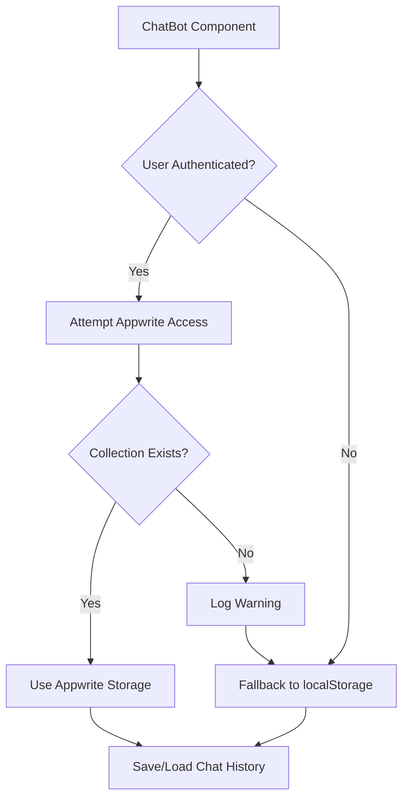

# Appwrite Chat History Collection Issue Analysis

## Overview

This document analyzes the 404 error occurring when trying to access the `chatHistory` collection in the Appwrite database. The error indicates that the collection has not been properly created in the database.

## Problem Description

The error message shows:
```
nyc.cloud.appwrite.io/v1/databases/atSupplyFinder/collections/chatHistory/documents?queries%5B0%5D=%7B%22method%22%3A%22equal%22%2C%22attribute%22%3A%22userId%22%2C%22values%22%3A%5B%2268b1f4a2001ed75bd0c1%22%5D%7D:1  Failed to load resource: the server responded with a status of 404 ()
```

This indicates that the `chatHistory` collection does not exist in the Appwrite database with ID `atSupplyFinder`.

## Root Cause Analysis

Based on the code analysis, the issue is that the `chatHistory` collection has not been created in the Appwrite database. The application has a migration script (`setup-chat-history.js`) designed to create this collection, but it appears it hasn't been run successfully.

The frontend code in `ChatBot.tsx` properly handles the 404 error by falling back to localStorage, but the error still appears in the console because the application is trying to access a non-existent collection.

## Solution

### Run the Migration Script

The project includes a migration script specifically designed to create the `chatHistory` collection:

1. Navigate to the project root directory
2. Run the migration script:
   ```bash
   npm run migrate:chat-history
   ```

This script will:
- Check if the `chatHistory` collection already exists
- Create the collection if it doesn't exist
- Set up the required attributes (`userId` and `messages`)
- Create the necessary indexes

### Prerequisites

Before running the migration script, ensure that your `.env` file contains the correct Appwrite configuration:
- `VITE_APPWRITE_ENDPOINT`
- `VITE_APPWRITE_PROJECT_ID`
- `VITE_APPWRITE_API_KEY`
- `VITE_APPWRITE_DATABASE_ID`

### Required API Key Permissions

The API key used in `VITE_APPWRITE_API_KEY` must have the following permissions:
- `collections.read`
- `collections.write`
- `attributes.write`
- `indexes.write`

If the API key lacks these permissions, the script will display an error message with instructions on how to update the permissions in the Appwrite Console.

## Current Fallback Behavior

The current implementation in `ChatBot.tsx` already handles the missing collection gracefully by:
1. Catching the 404 error when trying to access the collection
2. Logging a warning message to the console
3. Falling back to localStorage for chat history storage

This ensures that the application continues to function even when the collection is missing, but the error messages in the console indicate that the optimal storage solution (Appwrite database) is not available.

## Verification

After running the migration script, you can verify that the collection was created successfully by:
1. Checking the Appwrite Console to confirm the `chatHistory` collection exists
2. Observing that the 404 errors no longer appear in the browser console
3. Confirming that chat history is properly saved to and loaded from Appwrite

## Architecture Diagram



## Conclusion

The 404 error occurs because the `chatHistory` collection hasn't been created in the Appwrite database. Running the provided migration script will resolve this issue and enable proper chat history persistence in the database rather than relying on localStorage.