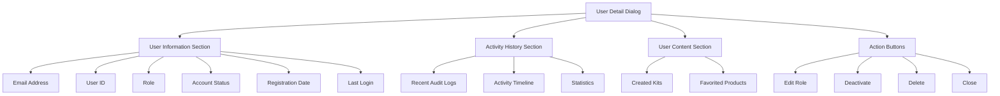

# User Management Improvements Design Document

## Overview

This document outlines the proposed improvements to the user management page in the admin panel. The enhancements include adding an "Add/Invite User" functionality, improving action buttons (particularly the "View User Details" feature), and removing the "New" text from the user management quick link button.

## Current State Analysis

The current implementation uses the `EnhancedUserManagement` component which provides:
- User listing with filtering and sorting capabilities
- Bulk operations (role changes, deletion, export)
- Basic user creation/invitation functionality
- User statistics cards
- Responsive design for different screen sizes

However, there are several areas for improvement:
1. The "View User Details" functionality is not fully implemented
2. The "New" badge on the User Management sidebar link should be removed
3. Action buttons could be more intuitive and user-friendly
4. User detail viewing experience could be enhanced

## Proposed Improvements

### 1. Remove "New" Badge from Sidebar Link

**Location**: `src/components/layout/AdminLayout.tsx`

**Change**: Remove the `badge: 'New'` property from the User Management sidebar item.

```typescript
{
  id: 'users',
  label: 'User Management',
  icon: Users,
  href: '/admin/users',
  requiredRole: 'admin'
}
```

### 2. Enhanced User Detail View

**New Component**: `UserDetailView`
- Create a modal dialog to display comprehensive user information
- Include user metadata, activity history, and role assignments
- Provide quick access to user actions (edit role, deactivate, delete)
- Display user statistics and engagement metrics
- Show audit trail of user activities
- Include user's created content (kits, favorites, etc.)

**Implementation**:
- Add a new dialog component that appears when clicking the "View" action button
- Fetch detailed user information including audit logs and activity history
- Display user information in a structured, readable format

### 3. Improved Action Buttons

**Current Issues**:
- Action buttons only appear on hover, reducing discoverability
- Limited actions available for each user
- No dedicated "View Details" button

**Improvements**:
- Make action buttons always visible (not just on hover)
- Add a dedicated "View Details" button with appropriate icon
- Improve button grouping and spacing for better usability
- Add tooltips for better understanding of each action
- Implement a dropdown menu for additional actions
- Use consistent iconography and styling
- Ensure accessibility compliance with proper ARIA attributes

### 4. Enhanced User Creation/Invitation Flow

**Improvements**:
- Add validation for email format
- Provide better feedback during the invitation process
- Add option to send custom invitation message
- Show success/error messages with clear next steps
- Add ability to invite multiple users at once
- Implement invitation status tracking

**UI Design**:
- Create a multi-step dialog for user creation/invitation
- Add form validation with real-time feedback
- Provide clear instructions for each step
- Show progress indicator for multi-step process
- Include preview of invitation email before sending

## Technical Implementation

### Database Changes

To support enhanced user management features, we need to add a new SQL migration file:

```sql
-- File: supabase/migrations/20250815181500_enhanced_user_management.sql

-- Add indexes for better performance on frequently queried columns
CREATE INDEX IF NOT EXISTS idx_user_profiles_email ON user_profiles(email);
CREATE INDEX IF NOT EXISTS idx_user_profiles_role ON user_profiles(role);
CREATE INDEX IF NOT EXISTS idx_user_profiles_last_sign_in ON user_profiles(last_sign_in_at);

-- Create a function to get detailed user information
CREATE OR REPLACE FUNCTION get_user_details(user_uuid UUID)
RETURNS TABLE (
    id UUID,
    email TEXT,
    role TEXT,
    created_at TIMESTAMP WITH TIME ZONE,
    last_sign_in_at TIMESTAMP WITH TIME ZONE,
    email_confirmed_at TIMESTAMP WITH TIME ZONE,
    is_active BOOLEAN,
    audit_logs JSONB
)
LANGUAGE sql
SECURITY DEFINER
AS $$
    SELECT 
        u.id,
        u.email,
        COALESCE(ur.role, 'user') as role,
        u.created_at,
        u.last_sign_in_at,
        u.email_confirmed_at,
        (u.last_sign_in_at IS NOT NULL AND u.last_sign_in_at > NOW() - INTERVAL '30 days') as is_active,
        (SELECT jsonb_agg(al.* ORDER BY al.timestamp DESC) 
         FROM audit_logs al 
         WHERE al.user_id = u.id 
         LIMIT 10) as audit_logs
    FROM auth.users u
    LEFT JOIN user_roles ur ON u.id = ur.user_id
    WHERE u.id = user_uuid;
$$;

-- Create a function to get user activity statistics
CREATE OR REPLACE FUNCTION get_user_activity_stats(user_uuid UUID)
RETURNS TABLE (
    total_kits INTEGER,
    total_favorites INTEGER,
    last_activity TIMESTAMP WITH TIME ZONE
)
LANGUAGE sql
SECURITY DEFINER
AS $$
    SELECT 
        (SELECT COUNT(*) FROM user_kits WHERE user_id = user_uuid) as total_kits,
        (SELECT COUNT(*) FROM user_favorites WHERE user_id = user_uuid) as total_favorites,
        GREATEST(
            (SELECT MAX(created_at) FROM user_kits WHERE user_id = user_uuid),
            (SELECT MAX(created_at) FROM user_favorites WHERE user_id = user_uuid)
        ) as last_activity;
$$;

-- Grant necessary permissions
GRANT EXECUTE ON FUNCTION get_user_details TO authenticated;
GRANT EXECUTE ON FUNCTION get_user_activity_stats TO authenticated;
```

### Component Modifications

#### 1. AdminLayout.tsx Changes

Remove the "New" badge from the User Management sidebar item:

```typescript
{
  id: 'users',
  label: 'User Management',
  icon: Users,
  href: '/admin/users',
  requiredRole: 'admin'
}
```

#### 2. EnhancedUserManagement.tsx Changes

**Add UserDetailView Component**:
- Create a new dialog component for viewing user details
- Fetch and display comprehensive user information
- Include audit log history for the user
- Show user activity statistics
- Implement user action buttons (edit role, deactivate, delete)

**Improve Action Buttons**:
- Make action buttons always visible
- Add dedicated "View Details" button
- Improve button styling and spacing
- Add dropdown menu for additional actions
- Implement proper accessibility attributes

**Enhance User Creation Flow**:
- Add form validation
- Improve success/error handling
- Add custom invitation message option
- Implement multi-user invitation
- Add invitation status tracking

**Additional Improvements**:
- Add real-time updates using Supabase subscriptions
- Implement better loading states and skeleton UI
- Add keyboard navigation support
- Improve responsive design for all screen sizes

### New Files to Create

1. **UserDetailView.tsx** - Dedicated component for viewing detailed user information
   - Implement modal dialog with user details
   - Include tabs for different information sections
   - Add action buttons for user management
   - Implement audit log display
   - Add user statistics visualization

2. **20250815181500_enhanced_user_management.sql** - Database migration for enhanced features
   - Add performance indexes
   - Create functions for detailed user information retrieval
   - Create functions for user activity statistics

3. **UserManagement.types.ts** - TypeScript definitions for user management
   - Define interfaces for user data structures
   - Define types for user actions and operations
   - Define enums for user statuses and roles

## UI/UX Improvements

### User Detail View Design

The User Detail View will be implemented as a modal dialog with the following sections:



### Action Button Improvements

**Current action buttons (hover-only)**:
```
[Eye] [Edit] [More...]
```

**Improved action buttons (always visible)**:
```
[View] [Edit] [Actions ▼]
```

With the dropdown containing:
- Change Role
- Deactivate User
- Delete User
- View Audit Logs
- Send Message

### Responsive Design

The user management interface will be optimized for different screen sizes:
- Desktop: Full table view with all columns visible
- Tablet: Collapsible columns with priority ranking
- Mobile: Card-based layout with expandable sections

## Security Considerations

1. All user management operations must be restricted to admin users only
2. Audit logging must be implemented for all user management actions
3. Proper error handling to prevent information leakage
4. Rate limiting for user creation/invitation to prevent abuse
5. Input validation to prevent injection attacks
6. Proper authentication checks for all user management endpoints
7. Secure handling of user data and PII
8. Implementation of proper access controls for user details
9. Protection against enumeration attacks when viewing user information
10. Secure storage and transmission of user data

## Performance Considerations

1. Implement pagination for user lists to prevent performance issues with large datasets
2. Use virtualization for large tables to improve rendering performance
3. Implement proper indexing in the database for frequently queried columns
4. Cache frequently accessed user data to reduce database load
5. Optimize audit log queries to prevent performance degradation
6. Implement lazy loading for user detail views
7. Use debouncing for search and filter operations
8. Optimize image loading for user avatars

## Testing Plan

### Unit Tests
1. Test user detail view component with mock data
2. Test action button functionality
3. Test user creation/invitation flow
4. Test database functions for user details retrieval
5. Test user activity statistics functions
6. Test form validation logic
7. Test error handling scenarios

### Integration Tests
1. Test end-to-end user management workflow
2. Test audit logging for user actions
3. Test role-based access control for user management features
4. Test real-time updates functionality
5. Test multi-user invitation process
6. Test user detail view with actual data

### UI Tests
1. Test responsive design on different screen sizes
2. Test accessibility compliance
3. Test user interaction flows
4. Test keyboard navigation support
5. Test loading states and skeleton UI
6. Test error message display
7. Test tooltip and help text functionality

## Implementation Steps

1. Create the database migration file for enhanced features
2. Modify AdminLayout to remove the "New" badge
3. Create UserDetailView component for detailed user information
4. Enhance action buttons in EnhancedUserManagement component
5. Improve user creation/invitation flow
6. Add comprehensive error handling and validation
7. Implement audit logging for all user management actions
8. Add real-time updates using Supabase subscriptions
9. Implement proper loading states and skeleton UI
10. Add keyboard navigation support
11. Ensure responsive design for all screen sizes
12. Conduct thorough testing of all new features
13. Update documentation and user guides

## Future Enhancements

1. Add user activity analytics dashboard
2. Implement user import/export with more file format options
3. Add user grouping and tagging features
4. Implement advanced search and filtering capabilities
5. Add user communication features (send messages to users)
6. Implement user session management
7. Add user preference customization
8. Create user onboarding workflows

## Conclusion

These improvements to the user management page will significantly enhance the admin experience by providing better tools for managing users, improved visibility into user activities, and a more intuitive interface. The changes will make it easier for administrators to perform their duties while maintaining security and performance standards. The implementation plan is designed to be modular, allowing for incremental deployment and testing to minimize disruption to existing workflows.