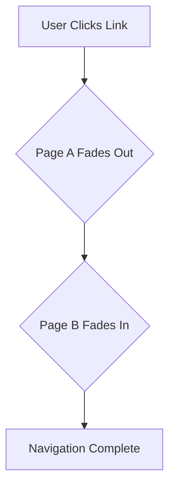

# Animation Strategy

This document outlines a comprehensive animation strategy to enhance the user experience of the application by making it more dynamic and clean.

## 1. Animation Library Recommendation

**Recommended Library:** [Framer Motion](https://www.framer.com/motion/)

**Justification:**

*   **Ease of Use:** Framer Motion provides a simple and declarative API that integrates seamlessly with React components.
*   **Powerful Features:** It offers a rich set of features including gestures, animations, and complex transitions with minimal code.
*   **Performance:** It's optimized for performance, ensuring smooth animations without compromising the user experience.
*   **Community and Documentation:** Framer Motion has a large and active community, and its documentation is extensive and easy to follow.
*   **Compatibility:** It works well with the existing `radix-ui` and `tailwind-css` setup.

## 2. Page Transition Strategy

Page transitions will create a seamless flow as users navigate through the application. We will implement a gentle fade-in/fade-out effect.

When a user navigates to a new page, the outgoing page will fade out, and the incoming page will fade in. This will be applied globally to all page navigations.

## 3. Component-Level Animations

Subtle animations on key components will guide the user's attention and make the interface feel more alive.

*   **Hero Component (`src/components/home/Hero.tsx`):**
    *   **Animation:** Staggered fade-in from the bottom for the main heading and subheading.
    *   **Effect:** Creates a sense of arrival and draws attention to the main value proposition.

*   **Product Table (`src/components/products/ProductTable.tsx`):**
    *   **Animation:** Each `ProductTableRow` will fade in and slide up sequentially as the data is loaded or paginated.
    *   **Effect:** Makes data-heavy tables feel less static and more engaging.

*   **Category Grid (`src/components/home/CategoryGrid.tsx`):**
    *   **Animation:** Each category card will scale up slightly and gain a subtle shadow on hover.
    *   **Effect:** Provides interactive feedback and a more tactile feel.

*   **Product Cards (`src/components/products/ProductCard.tsx`):**
    *   **Animation:** Similar to category cards, product cards will have a slight scale-up and shadow effect on hover. When a filter is applied, the cards will gracefully re-arrange and fade in/out.
    *   **Effect:** Improves the browsing experience and provides clear visual feedback on interactions.

## 4. Implementation Roadmap

This roadmap will be handed off to the `code` mode for implementation.

*   **Step 1: Install and Configure Framer Motion:**
    *   Add `framer-motion` as a project dependency.
    *   No special configuration is needed; it works out of the box.

*   **Step 2: Implement Page Transitions:**
    *   Create a reusable `AnimatedPage` component that wraps page content with `motion` components.
    *   Apply this wrapper to each page in `src/App.tsx` or the router configuration.

*   **Step 3: Animate Key Components:**
    *   **Hero Component:** Wrap the text elements in `motion.div` and use the `initial`, `animate`, and `transition` props to create the staggered fade-in effect.
    *   **Product Table:** Use `motion.tr` for table rows and orchestrate the stagger animation using `staggerChildren` on the `motion.tbody` element.
    *   **Category Grid & Product Cards:** Use the `whileHover` prop on `motion.div` to apply the scale and shadow animations.

*   **Step 4: Refine and Test:**
    *   Review all animations to ensure they are smooth and not distracting.
    *   Test across different browsers and devices to ensure consistent performance.